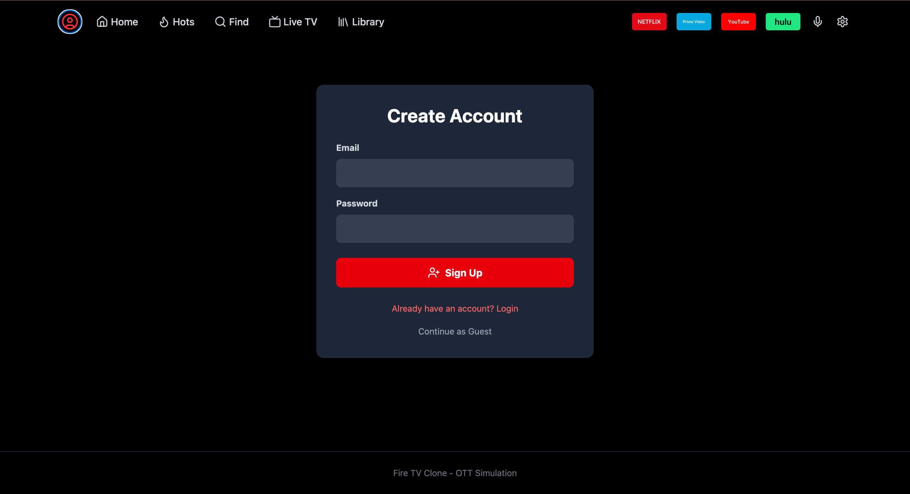
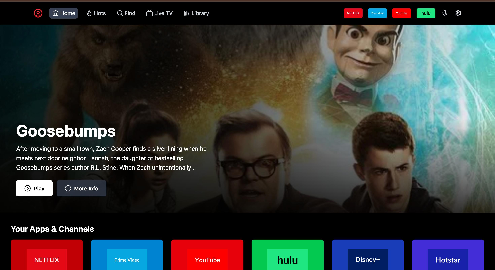
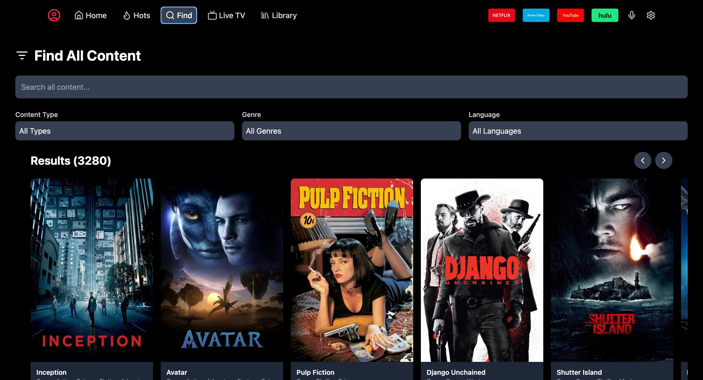
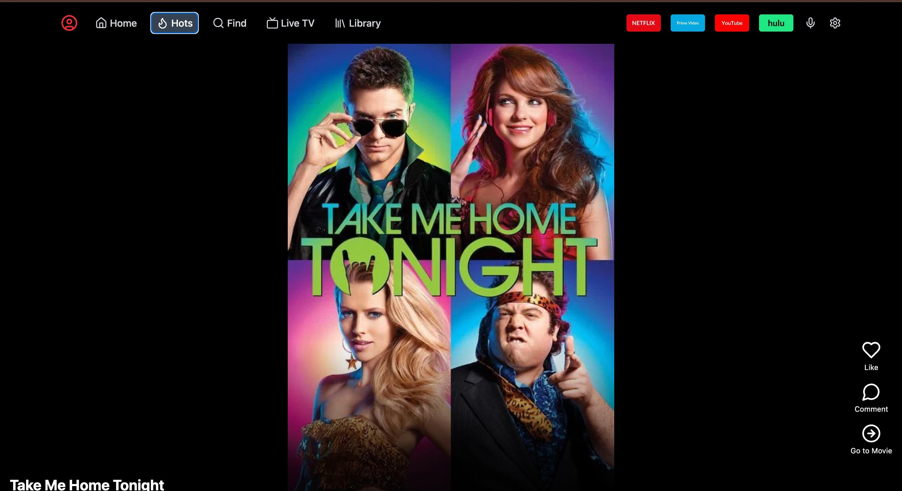
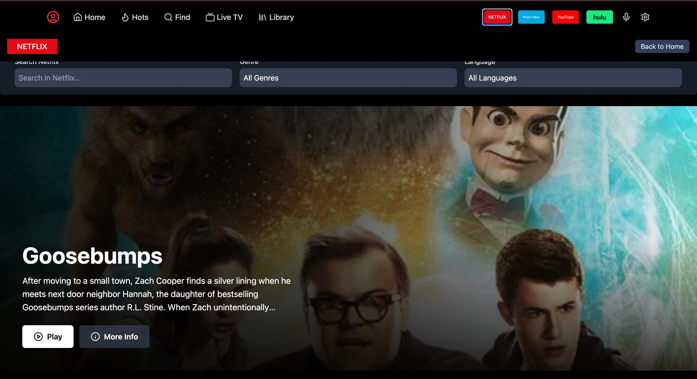
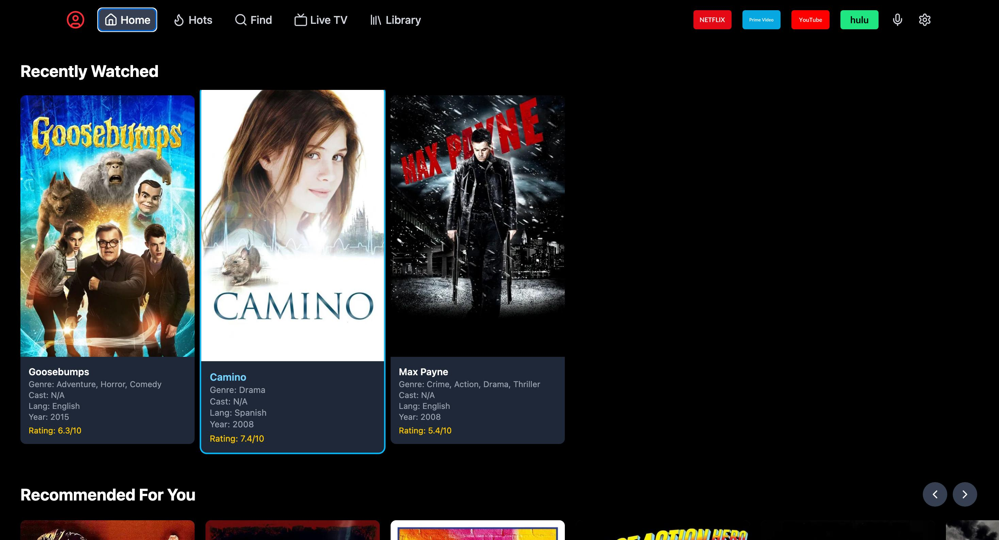
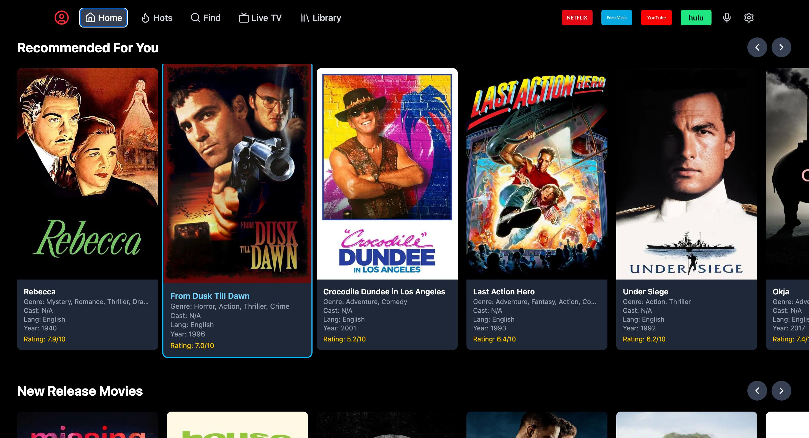
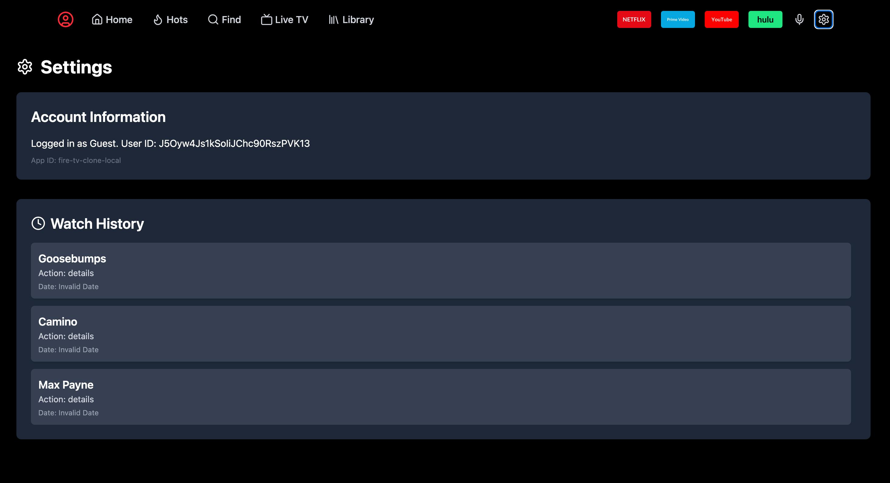

# 🔥 Fire TV Clone with Hybrid Recommendation System










A full-stack streaming platform that replicates the UI and functionality of **Amazon Fire TV**, with a powerful **hybrid recommendation engine** powered by Python and the `Surprise` library.

---

## 🚀 Features

- 🎨 **Modern UI:** Built with React + Vite + Tailwind CSS
- 📺 **Multiple Pages:** Home, Find, Hots (TikTok-style), Netflix-like UI
- 🎯 **Hybrid Recommendations:**
  - Content-Based Filtering
  - Collaborative Filtering (SVD)
- 🔁 **Simulated User History:** Firebase Firestore used for storing watched content
- ⚙️ **Backend API:** Python + Flask serving ML recommendations via REST
- 📊 **Asynchronous CSV Parsing:** Fast client-side loading via PapaParse

---

## 🧰 Tech Stack

| Frontend         | Backend        | ML/RecSys                      | Database           |
| ---------------- | -------------- | ------------------------------ | ------------------ |
| React + Vite     | Python + Flask | Surprise, Pandas, Scikit-learn | Firebase Firestore |
| Tailwind CSS     | Flask-CORS     |                                |                    |
| Axios, PapaParse |                |                                |                    |

---

## 🛠️ Setup Instructions

> ⚠️ Make sure you have **Node.js**, **Python**, and **pip** installed on your system.

---

### 1. 🚚 Clone the Repository

```bash
git clone https://github.com/GitH22Ash/fire-tv-recommendation-app.git
cd fire-tv-recommendation-app
```

---

### 2. 📦 Frontend Setup

```bash
npm install
```

---

### 3. 🐍 Backend Setup (Python)

```bash
# Navigate into the backend directory
cd backend

# Create and activate a virtual environment

# For Windows (CMD or PowerShell)
python -m venv venv
venv\Scripts\activate

# For Git Bash
source venv/Scripts/activate

# For macOS/Linux
source venv/bin/activate

# Install dependencies
pip install -r requirements.txt
```

---

### 4. 🔐 Firebase Configuration

#### 🧱 Create a Firebase Project

- Go to [Firebase Console](https://console.firebase.google.com/)
- Create a new project (e.g., `fire-tv-clone`)
- Register a Web App and get the `firebaseConfig` object

#### ⚙️ Enable Firebase Services

- **Authentication:** Enable `Email/Password` and `Anonymous` providers
- **Firestore:** Start in test mode → Select location → Enable

#### 🧾 Create `.env.local` File

In the root directory, create `.env.local` and add:

```env
VITE_API_KEY="YOUR_API_KEY"
VITE_AUTH_DOMAIN="YOUR_AUTH_DOMAIN"
VITE_PROJECT_ID="YOUR_PROJECT_ID"
VITE_STORAGE_BUCKET="YOUR_STORAGE_BUCKET"
VITE_MESSAGING_SENDER_ID="YOUR_MESSAGING_SENDER_ID"
VITE_APP_ID="YOUR_APP_ID"
```

Replace placeholders with values from your Firebase config.

---

### 5. 📂 Add Movie Data & Model Files

The recommendation engine requires several data files. This repository does not include the data files themselves. Sample data files are provided, but you can replace them with your own or generate them as needed.

#### 🔸 Movie Dataset

```bash
# Place this in the frontend public folder
public/my_movies.csv
```

#### 🔸 Model Files

```bash
# Place these in the backend folder
backend/database.pkl
backend/model.pkl
backend/ratings.pkl
```

---

## 🔄 Running the App

### ▶️ Start the Backend (Flask)

```bash
# Inside backend folder with venv activated
python app.py
```

> Backend runs at: `http://127.0.0.1:5000`

---

### ▶️ Start the Frontend (React + Vite)

```bash
# From the project root
npm run dev
```

> Frontend runs at: `http://localhost:5173`

---

## 🧠 Recommendation System Details

- **Content-Based:** Finds similar movies based on content features
- **Collaborative Filtering (SVD):** Suggests movies rated highly by similar users
- **Dataset:** Custom movie CSV dataset loaded via PapaParse
- **Backend Model:** Trained using Surprise, pandas, and scikit-learn

---

## 📬 Contributing

Pull requests are welcome! Feel free to fork the repo and open a PR with improvements or new features.

---
